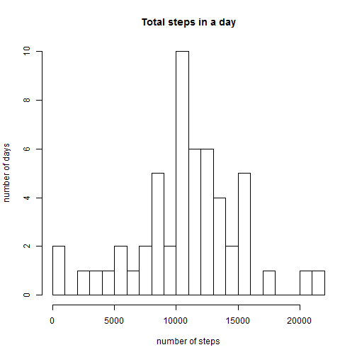
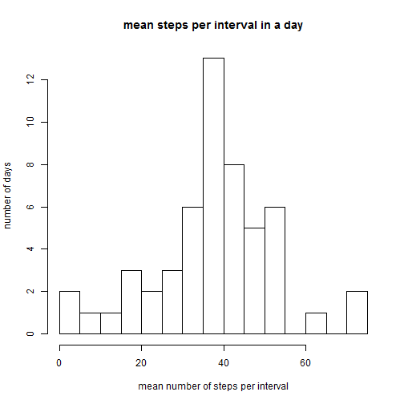
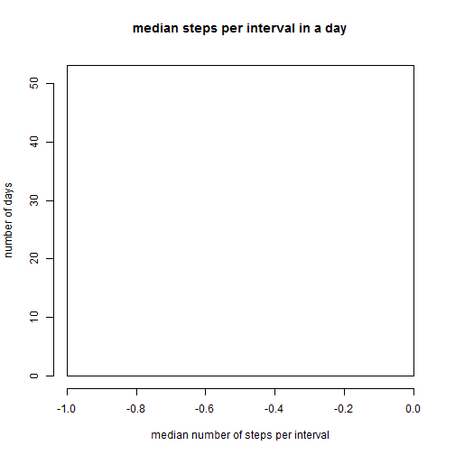
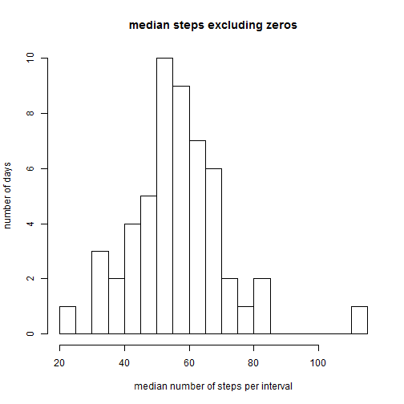
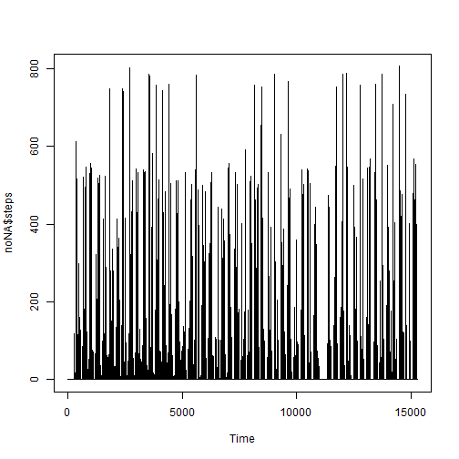
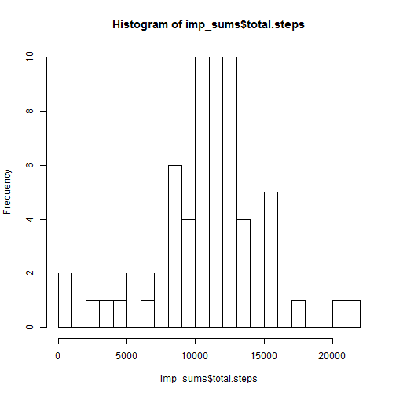
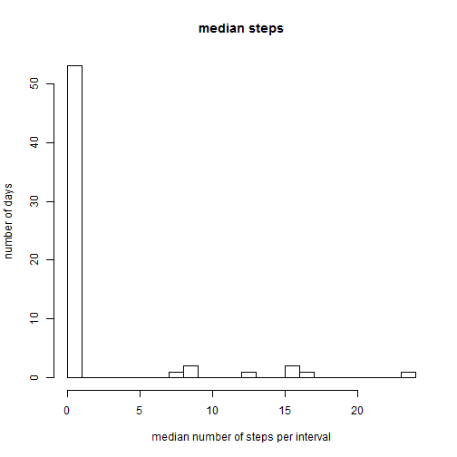
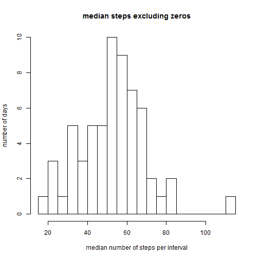
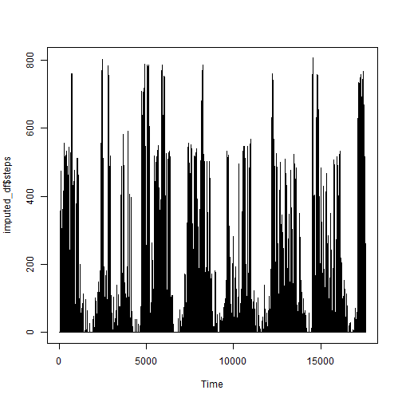

###import and prepare the files
Set the working directory and open the file

```r
setwd("C:/Users/homepc/Dropbox/Labshare/UJames/Coursera/data_science/reproducible_research/project1")
activity <- read.csv("activity.csv")
```
Convert dates to date format, and create a new column containing the days of the week

```r
activity$date <- as.Date(activity$date)
activity$weekdays <- weekdays(as.Date(activity$date, '%Y-%m-%d'))
```
Remove NAs and check that there is sufficient sample size for each interval to do imputation


```r
noNA <- subset(activity, steps != "NA")
noNA$comb <- paste(noNA$weekdays, noNA$interval)
count_table <- table(noNA$comb)
min(count_table)
```

```
## [1] 7
```

```r
max(count_table)
```

```
## [1] 9
```

###impute missing values
There are 7-9 data points for each weekday/interval combination, so I feel comfortable using the mean for each combination to impute the NA values in "activity", and create a new data frame, "imputed_df", containing the imputed missing values.


```r
imputed_means <- aggregate(steps ~ weekdays + interval, data=activity, FUN="mean", na.rm=TRUE)
allNAs <- activity[is.na(activity$steps),]
colnames(imputed_means)[colnames(imputed_means)=="steps"] <- "imputed.steps"
merged <- merge(imputed_means, activity)
imputed_df <- merged
imputed_df$cpsteps <- imputed_df$steps
imputed_df$cpsteps[is.na(imputed_df$cpsteps)] <- as.numeric(imputed_df$imputed.steps[is.na(imputed_df$cpsteps)])
```


###Calculate daily sum, and mean and median number of steps per 5-minute interval, and find the interval with the highest average number of steps.

Get the sums for each day, and make a histogram of them

```r
sums <- aggregate(noNA$steps, by=list(noNA$date), "sum")
colnames(sums) <- c("date","total.steps")
hist(sums$total.steps, 
     breaks=25, 
     main="Total steps in a day", 
     xlab="number of steps", 
     ylab="number of days")
```



Get the means for each day, and make a histogram

```r
means <- aggregate(noNA$steps, by=list(noNA$date), "mean")
colnames(means) <- c("date","mean.steps")
hist(means$mean.steps, 
     breaks=25, 
     main="mean steps per interval in a day", 
     xlab="mean number of steps per interval", 
     ylab="number of days")
```



Get the medians for each day, and make a histogram

```r
medians <- aggregate(noNA$steps, by=list(noNA$date), "median")
colnames(medians) <- c("date","median.steps")
hist(medians$median.steps, 
     breaks=25, 
     main="median steps per interval in a day", 
     xlab="median number of steps per interval", 
     ylab="number of days")
```



Because more than half of the intervals contain zero steps, it makes more sense to look at the median after excluding those intervals.

```r
noZero <- subset(noNA, steps != 0)
NZmedians <- aggregate(noZero$steps, by=list(noZero$date), "median")
colnames(NZmedians) <- c("date","median.steps")
hist(NZmedians$median.steps, 
     breaks=25, 
     main="median steps excluding zeros", 
     xlab="median number of steps per interval", 
     ylab="number of days")
```


Make a time series plot. This can be done in simple fashion because the data are already in order of time series

```r
plot.ts(noNA$steps)
```



Get the interval with the most steps (averaged across days)

```r
intervals <- aggregate(noNA$steps, by=list(noNA$interval), "mean")
colnames(intervals) <- c("interval","mean.steps")
top.interval <- intervals[which(intervals$mean.steps == max(intervals$mean.steps)), ]
print(top.interval)
```

```
##     interval mean.steps
## 104      835   206.1698
```


### Do the same calculations of sum, mean, and median using the dataframe containing the imputed values, and find the interval with the highest average number of steps

Sum:

```r
imp_sums <- aggregate(imputed_df$cpsteps, by=list(imputed_df$date), "sum")
colnames(imp_sums) <- c("date","total.steps")
hist(imp_sums$total.steps, breaks=25)
```


Mean:

```r
imp_means <- aggregate(imputed_df$cpsteps, by=list(imputed_df$date), "mean")
colnames(imp_means) <- c("date","mean.steps")
```
Medians:

```r
imp_medians <- aggregate(imputed_df$cpsteps, by=list(imputed_df$date), "median")
colnames(imp_medians) <- c("date","median.steps")
hist(imp_medians$median.steps, 
     breaks=25, 
     main="median steps", 
     xlab="median number of steps per interval", 
     ylab="number of days")
```



Medians excluding zeros:

```r
imp_noZero <- subset(imputed_df, cpsteps != 0)
imp_NZmedians <- aggregate(imp_noZero$cpsteps, by=list(imp_noZero$date), "median")
colnames(imp_NZmedians) <- c("date","median.steps")
hist(imp_NZmedians$median.steps, 
     breaks=25, 
     main="median steps excluding zeros", 
     xlab="median number of steps per interval", 
     ylab="number of days")
```


Make a time series plot. This can be done in simple fashion because the data are already in order of time series

```r
plot.ts(imputed_df$steps)
```



Interval with the most steps:

```r
imp_intervals <- aggregate(imputed_df$cpsteps, by=list(imputed_df$interval), "mean")
colnames(imp_intervals) <- c("interval","mean.steps")
imp_top.interval <- imp_intervals[which(imp_intervals$mean.steps == max(imp_intervals$mean.steps)), ]
print(imp_top.interval)
```

```
##     interval mean.steps
## 104      835   208.5056
```

Compare weekdays and weekends using the imputed data set

```r
weekdays <- c("Monday", "Tuesday", "Wednesday", "Thrusday", "Friday")
imputed_df$wdwe <- as.factor(ifelse(is.element(weekdays(as.Date(imputed_df$date)), weekdays), "Weekday", "Weekend"))
aggregate(steps~wdwe, imputed_df, mean)
```

```
##      wdwe    steps
## 1 Weekday 37.09834
## 2 Weekend 37.78314
```

It doesn't look like much, but do an ANOVA test to be sure:

```r
anova <- aov(steps ~ wdwe, data=imputed_df)
summary(anova)
```

```
##                Df    Sum Sq Mean Sq F value Pr(>F)
## wdwe            1      1738    1738   0.139   0.71
## Residuals   15262 191442062   12544               
## 2304 observations deleted due to missingness
```
There is no difference between weekdays and weekends.
